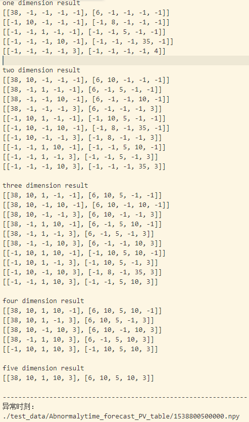
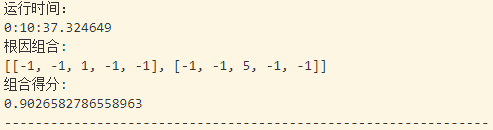

# rootcause

## 文件描述：

- hotspot.py: 二维版本代码

- version1.py: 单线程版本，可进行五个维度的根因分析，需要较长时间。

- version2.py: 多线程版本，可进行五个维度的根因分析。（由于python的全局解释锁机制，一次只能执行一个线程，与普通版本比基本没有速度上的差异）

- version3.py: 多进程版本。同一时刻，一个CPU核运行一个进程，多核并行加速运算。如果是10核以上电脑可正常运行。若低于10核，需做一定改动，否则CPU的任务切换会耗费一定时间。

- run.py: 用于执行整个文件夹数据。（默认执行version3.py，M=10，PT=0.75）

- test_data: 数据集

- record_test1.md: 数据集描述

**tips**: version1.py中，元素值使用下标表示，若集合为(0, *, 5, *, *, *)， 则对应seq为(0, -1, 5, -1, -1,- 1)

## 初步结果：

